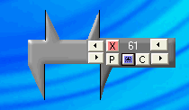



## Screen Calipers Revisited

### Description

Re-make of my earlier submission.Changed the graphics and added the connector bar.Commented when needed.Hope you like the new version.If you make any improvements, I'd like to see them.

Added 1/9/07: Now you can select between pixels and twips. Also fixed a couple of bugs.

Revised Code:1/10/07... Redraw much improved and positions and values retained when switching from V to H.

1/12/07..Added color selection and changed some code.

1/13/07...Added Rocky Clarks A+ Screen Zoom to the project. Lets you fine tune measurements easier.
 
### More Info
 

             |
---                |---
**Submitted On**   |2007-01-13 16:11:38
**By**             |[Kenneth Foster](https://github.com/Planet-Source-Code/PSCIndex/blob/master/ByAuthor/kenneth-foster.md)
**Level**          |Intermediate
**User Rating**    |4.9 (79 globes from 16 users)
**Compatibility**  |VB 6\.0
**Category**       |[Miscellaneous](https://github.com/Planet-Source-Code/PSCIndex/blob/master/ByCategory/miscellaneous__1-1.md)
**World**          |[Visual Basic](https://github.com/Planet-Source-Code/PSCIndex/blob/master/ByWorld/visual-basic.md)
**Archive File**   |[Screen\_Cal2042371132007\.zip](https://github.com/Planet-Source-Code/kenneth-foster-screen-calipers-revisited__1-67585/archive/master.zip)

